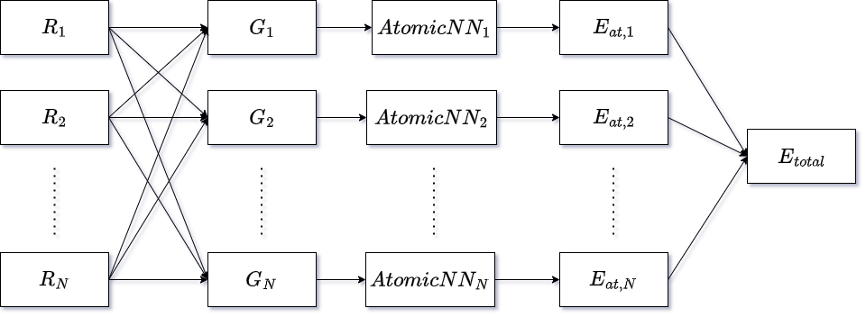

Behler-Parrinello Neural Network
================================

**Behler-Parrinello Neural Network (BPNN)** is a type of neural network specifically designed
to approximate potential energy surfaces in molecular dynamics simulations :cite:`bpnn, behler2021`.

It uses special architecture called **High-Dimensional Neural Network (HDNN)** that contains 2 main parts:
1. **Symmetry Functions** - to encode the local environment of atoms in a system.
2. Subnets - **Atomic Networks (AtomicNN)** - for each sort of atoms (chemical species) in the system.

.. note::
   The BPNN architecture is a generalization of the Behler-Parrinello approach to neural networks,
   which allows for the representation of complex potential energy surfaces in high-dimensional spaces.

Atomic-Centered Symmetry Functions
==================================

For the BPNN to work, it is necessary to encode the local environment of atoms in a system.
This is done using **Atomic-Centered Symmetry Functions (ACSF)** :cite:`acsf` that is used as an input to the network.

ACSFs are designed to be invariant to translations, rotations, and permutations of atoms in the system
so it encodes uniquely the local environment of each atom. There are two types of ACSFs:
1. **Radial Functions** - depend only on the distance between atoms.

.. math:: G_1^i = \sum_j^{N_{\text{atoms}}} f_c (R_{ij}),
.. math:: G_2^i = \sum_j^{N_{\text{atoms}}} e^{-\eta (R_{ij} - R_s)^2} f_c (R_{ij}),
.. math:: G_2^i = \sum_j^{N_{\text{atoms}}} \kappa \cos(R_{ij}) f_c (R_{ij}),

where :math:`f_c` is a cutoff function that can be defined as:

.. math:: f_c (R_{ij}) = \begin{cases}
    \frac{1}{2} \left( 1 + \cos\left(\frac{\pi R_{ij}}{R_{\text{cut}}}\right) \right), & \text{for} R_{ij} < R_{\text{cut}} \\
    0, & \text{for} R_{ij} \geq R_{\text{cut}} \\
    \end{cases}

2. **Angular Functions** - depend on the angles between bonds.
